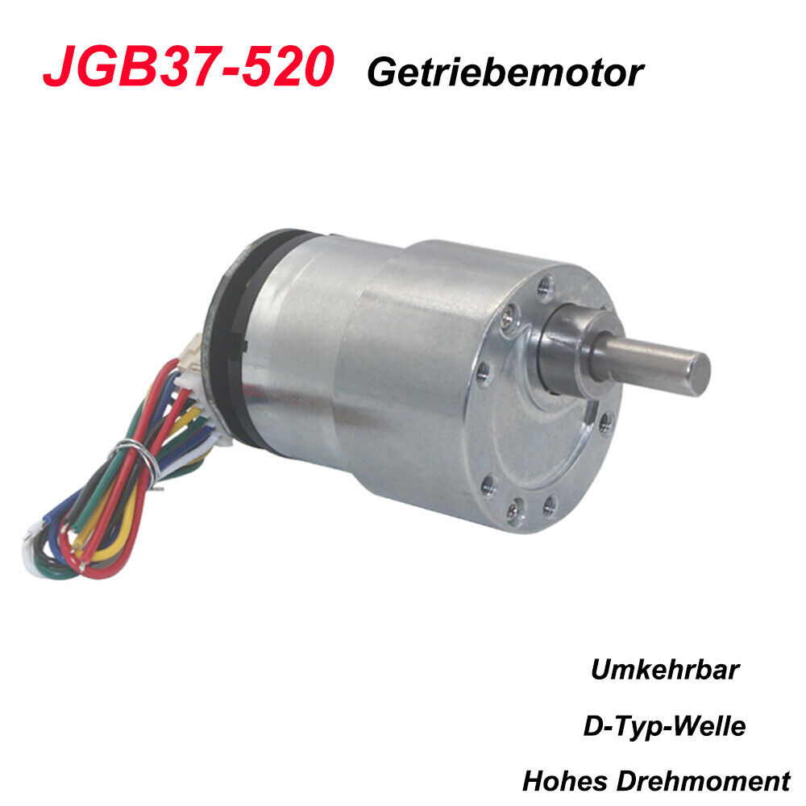

# Introduction

The purpose of this test is to get to know the encoder and it's output in isolation from all other features of a PID control system.
No PID controller is involved. After the test, it is validated that:

- the power supply works
- the motor works
- which wire on the motor is used for which purpose
- the wiring is correct
- the motor encoder works
- the arduino works
- the signals that the encoder outputs can be converted to meaningful information on the arduino.

This first test will use a DC power supply to drive the motor at constant speed based on the voltage supplied.
It will read signals from the DC motor's encoder and process the encoder signals using the Arduino.

This encoder test lays the groundwork for a closed loop system used in later steps.

## What is an Encoder

For people entering the world of electronics engineering, power electronics or motor control, the term encoder
is not clear but it is very oftern used without being explained. I am not a professional electronics engineer myself
but I give you the definition of what I think an encoder does.

An encoder is a sensor. Instead of a way to send power or signals into a motor, an encoder is a means to get information
out of the motor. Without reading data from the motor, closed loop control over the motor properties (such as current rotational speed (RPM))
is not possible since without feedback from the motor, there is no closed loop.

Not every motor has an encoder by default. An encoder is often times attached to the motor shaft. Most servo motors do not
have an encoder. Some DC motors do not have an encoder. When you start shopping for a motor, get a motor or servo that has
an encoder.

The encoder is attached to the shaft and it will return signals when the shaft rotates. Instead of giving you a voltage that
is proportional to the motor speed, most encoders are constructed more simple. The encoder has two wires and it will change
the voltage on the wires producing flanks as the shaft turns.

It is the responsibilty of the engineer to convert the flank signals into meaningful information. 

Different encoders use different output signaling. The encoder used with the JGB-520 uses one wire for sending interrupt 
signals and another wire for the direction that the motor turns in.

Other encoders might just send flanks on both wires. Then Signals on wire A and wire B are a constant offset apart and hence they will form a very specific pattern. 
Looking at a diagram such as https://www.waycon.de/produkte/encoder-winkelgeber/messprinzip-encoder-drehgeber/ 
the order in which signals on A and B go high is specific to the direction in which the motor turns. This means that the interrupt
handler can determine that the shaft has been turned by an increment and in which direction this incremental turn has taken place.

Different encoders come in different resolutions. If you know the resolution of your encoder (say 10 increments per full 360 degree rotation 
of the shaft) then you know the rotation angle of the motor. If you somehow keep track of time also, then you can compute the rotational
velocity (also just called the motor's velocity) by dividing the rotational angle increment by time similar how you would divide distance
by time to arrive at directional velocity.

This is how an encoder helps you figure out the current speed of the motor. (Given the voltage that produces the speed, this is the 
basis of a closed loop system that lets you control speed. Voltage in, speed out)

By just keeping track of the rotational increments and integrating (summing) those values up, you can keep track of the relative position
of the motor based on the situation where power has been switched on.

To turn a unknown relative position into a position relative to some boundary (a wall of your room/flat/building) how about make
the motor turn slowely until the system hits a barrier and then declaring this position as absolute position zero?

Given the encoder, you can start controlling the speed of your motor and defining positions in space.

## The Motor used

The motor used is the JGB-520.
It is a 12V DC motor that goes up to 1000 RPM according to the label on the housing.

eBay: https://www.ebay.de/itm/166471920023?mkcid=16&mkevt=1&mkrid=707-127634-2357-0&ssspo=zsyxprhrtzy&sssrc=2047675&ssuid=plgx2AkNTy-&widget_ver=artemis&media=COPY



## Wiring

The JGB-520 comes with an encoder built in.

The wiring does supply power to the motor:

- Red Cable = +VCC motor (12V max)
- White Cable = GND motor

It also supplies power to the encoder

- Yellow = +VCC encoder (5V)
- Black = GND encoder

The signals of the encoder are

- Green - Encoder Wire A (interrupt)
- Blue - Encoder Wire B (direction)


## Reading informaton from the JGB-520 encoder

The JGB-520 will output a signal on the encoder wire A (green), whenever it wants to trigger an interrupt.
The strategy in the encoder_test sketch is to put a interupt on the rising edge of encoder wire A (green).

```
void setup() {
  Serial.begin(9600);
  pinMode(ENCA, INPUT);
  pinMode(ENCB, INPUT);
  attachInterrupt(digitalPinToInterrupt(ENCA), readEncoder, RISING);
}

void readEncoder() {
  int b = digitalRead(ENCB);
  if (b > 0) {
    posi++;
  } else {
    posi--;
  }
}
```

Inside the rising edge interrupt handler attached to encoder wire A (green), the value of encoder wire B (blue) is read.
Looking at the state of wire B during an interrupt yields the following insight: If B is positive, the motor turned into one direction, 
if B is negative, the motor turned into the other direction by a single increment.

